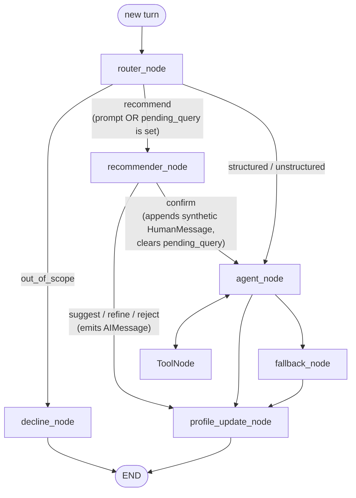

## Goal

Implement Assignment 3 Bonus B (Query Recommender, +10 pts). When the user asks "what should I query next?" (or a follow-up to a prior suggestion), the agent suggests a relevant query, lets the user refine it, and executes it only on explicit confirmation. Use the conversation history (already in the SqliteSaver checkpoint per `thread_id`) and the per-user profile (already on disk per `user_id`) as the basis for suggestions.

## Design at a glance



Key invariants:
- `pending_query` is the single source of truth for "there is a suggestion outstanding". It's already declared on [GraphState](src/cs_agent/agent/state.py) and persisted by `SqliteSaver` per `thread_id`, so resuming a session preserves the pending suggestion.
- Confirmation is executed by appending a synthetic `HumanMessage(content=pending_query)` to `messages` and routing to `agent_node`. No changes to `agent_node` or its system prompt are needed — the resolved query becomes the agent's question.
- The historical confirmation ("yes, do it") stays in the message log for transcript honesty.

## Concrete changes

### 1. State — add `recommend` route

[src/cs_agent/agent/state.py](src/cs_agent/agent/state.py): extend the `Route` Literal:

```python
Route = Literal["structured", "unstructured", "out_of_scope", "recommend"]
```

No new fields — `pending_query: str | None` already exists.

### 2. Router — short-circuit + new prompt class

[src/cs_agent/agent/router.py](src/cs_agent/agent/router.py):

- Add `recommend` to the `RouterDecision.route` enum (same `Route` import).
- Inside `router_node`, before the LLM call: if `state.get("pending_query")` is set, return `{"route": "recommend"}` directly (cheap, deterministic, avoids an LLM round-trip and prevents misclassification of "yes" / "no" follow-ups).
- Update `route_from_router` to map `"recommend"` → `"recommender"`.

[src/cs_agent/agent/prompts.py](src/cs_agent/agent/prompts.py) — extend `ROUTER_SYSTEM` with a fourth route:

```
- "recommend": the user is asking for a query suggestion or follow-up
  recommendation. Examples: "what should I query next?", "any ideas for
  what to look at?", "what else can I ask?".
```

### 3. New node — `recommender_node`

Put it in a new module to keep files small (current `nodes.py` is already dense): [src/cs_agent/agent/recommender.py](src/cs_agent/agent/recommender.py).

Two phases, distinguished by whether `pending_query` is already set:

- **First call (no pending)** — generate a suggestion:
  1. Read profile (`load_profile(user_id)`) and the last ~10 messages.
  2. Call the **agent LLM** with `with_structured_output(Suggestion)` where `Suggestion(BaseModel)` has `query: str` and `rationale: str`.
  3. Set `pending_query = suggestion.query`.
  4. Emit `AIMessage` like: `"Based on your interest in {rationale}, you might want to: \"{query}\". Want me to run it, refine it, or pick something else?"`.

- **Follow-up call (pending set)** — classify intent and act:
  1. Use the **router LLM** with `with_structured_output(RecommenderIntent)` where `RecommenderIntent(BaseModel)` has `intent: Literal["confirm", "refine", "reject"]` and `refinement: str | None`.
  2. **confirm** → return `Command(goto="agent", update={"messages": [HumanMessage(pending_query)], "pending_query": None, "iterations": 0})`. The `iterations` reset is required so the agent gets its full ReAct budget.
  3. **refine** → regenerate a new suggestion using the same Suggestion call but feeding `refinement` as additional context; set `pending_query` to the new query and emit an AIMessage like `"Then I'd suggest: \"{new_query}\". Should I go ahead?"`.
  4. **reject** → clear `pending_query` to `None`, emit `AIMessage("Got it — dropping the suggestion. What would you like to know?")`.

Add two prompt constants to [src/cs_agent/agent/prompts.py](src/cs_agent/agent/prompts.py):
- `RECOMMENDER_SUGGEST_SYSTEM` — "Look at the user profile and recent turns. Suggest ONE concrete next query that can be answered with the dataset tools (count, list, examples, distribution, summarize). Output JSON {query, rationale}."
- `RECOMMENDER_INTENT_SYSTEM` — "Classify the user's reply to a query suggestion as 'confirm' / 'refine' / 'reject'. If 'refine', extract the refinement instruction."

### 4. Graph — wire the new node

[src/cs_agent/agent/graph.py](src/cs_agent/agent/graph.py):

```python
from cs_agent.agent.recommender import recommender_node, route_from_recommender

builder.add_node("recommender", recommender_node)

builder.add_conditional_edges(
    "router",
    route_from_router,
    {"agent": "agent", "decline": "decline", "recommender": "recommender"},
)
builder.add_conditional_edges(
    "recommender",
    route_from_recommender,
    {"agent": "agent", "profile": "profile"},
)
```

`route_from_recommender` returns `"agent"` when the recommender produced a confirmation (detected as: last message is a `HumanMessage` and `pending_query is None`) and `"profile"` otherwise (suggest / refine / reject).

Alternative: have `recommender_node` return a `Command(goto=...)` on confirm and a plain dict otherwise — LangGraph supports both. Pick the conditional-edge style to match the existing `should_continue` pattern in [nodes.py](src/cs_agent/agent/nodes.py).

### 5. UI — render the recommender node

- [src/cs_agent/cli.py](src/cs_agent/cli.py) `_render_chunk`: add a branch for `node_name == "recommender"` that prints the AIMessage in a `Panel` titled `recommender (awaiting confirmation)` with `border_style="cyan"`.
- [src/cs_agent/ui/rendering.py](src/cs_agent/ui/rendering.py) `chunk_to_reasoning_steps`: extend the node-name switch to handle `"recommender"` — treat the AIMessage as a `final` answer (for the live stream) so the Streamlit chat bubble shows it, and add a `ReasoningStep(kind="router", text="recommender → awaiting confirmation")` so the expander records that the recommender ran. No change needed to `messages_to_turns` — the recommender's AIMessages are normal `AIMessage` instances and replay correctly.

### 6. Verifier — `scripts/verify_bonus_b.py`

Mirror [scripts/verify_bonus_a.py](scripts/verify_bonus_a.py) structure. Cases (offline by default, live behind `NEBIUS_API_KEY`):

1. **router-short-circuit** — `router_node({"messages": [HumanMessage("yes")], "pending_query": "X"})` returns `{"route": "recommend"}` with no LLM call (monkeypatch `get_router_llm` and assert it's not invoked).
2. **suggest-shape** — `recommender_node({...empty pending_query...})` with a mocked LLM that returns a fixed `Suggestion` produces an AIMessage and sets `pending_query` to the mocked query.
3. **confirm-routes-to-agent** — with `pending_query="show 5 examples from REFUND"` set and last message `HumanMessage("yes")`, recommender clears pending_query, appends synthetic HumanMessage, and `route_from_recommender` returns `"agent"`.
4. **refine-regenerates** — with `pending_query="A"` and human `"I'd rather see examples"`, recommender updates `pending_query` to a new value (mocked) and `route_from_recommender` returns `"profile"`.
5. **reject-clears** — with `pending_query="A"` and human `"no, cancel"`, recommender returns `pending_query=None` and an apology AIMessage.
6. **live-flow** (optional, gated on `NEBIUS_API_KEY`) — drive the real graph through suggest → confirm → assert tool call happens and pending_query ends as None.

### 7. README + master plan

- [README.md](README.md): add a "Bonus B — Query Recommender" subsection in *What works today* and *Walkthroughs* showing the assignment's example flow verbatim, update the architecture mermaid to include `recommender_node`.
- [.cursor/plans/cs-agent-master-plan_809e184c.plan.md](.cursor/plans/cs-agent-master-plan_809e184c.plan.md): flip the `recommender` todo from `pending` to `completed` and update the prose status line at the top.

### 8. Models / cost

- Suggestion generation: `get_agent_llm()` (Llama 3.3 70B). It needs the conversation + profile context and quality matters most here.
- Intent classification: `get_router_llm()` (Qwen3-32B). Three-class structured output — cheap and fast.

## Files touched

- modified: [src/cs_agent/agent/state.py](src/cs_agent/agent/state.py) (add `"recommend"` literal)
- modified: [src/cs_agent/agent/router.py](src/cs_agent/agent/router.py) (short-circuit, route map)
- modified: [src/cs_agent/agent/prompts.py](src/cs_agent/agent/prompts.py) (router prompt update + 2 new prompts)
- modified: [src/cs_agent/agent/graph.py](src/cs_agent/agent/graph.py) (wire recommender)
- modified: [src/cs_agent/cli.py](src/cs_agent/cli.py) (render recommender panel)
- modified: [src/cs_agent/ui/rendering.py](src/cs_agent/ui/rendering.py) (chunk translation branch)
- modified: [README.md](README.md) (section + diagram)
- modified: [.cursor/plans/cs-agent-master-plan_809e184c.plan.md](.cursor/plans/cs-agent-master-plan_809e184c.plan.md) (mark todo done)
- new: [src/cs_agent/agent/recommender.py](src/cs_agent/agent/recommender.py) (node + intent classifier + route fn)
- new: [scripts/verify_bonus_b.py](scripts/verify_bonus_b.py) (5–6 cases)

No new dependencies. No changes to tools or MCP server. No changes to `agent_node`, `profile_update_node`, or the SqliteSaver wiring.

## Out of scope

- Multi-turn refinement chains beyond a single re-suggestion (current design regenerates from scratch each refine — adequate for the assignment).
- Persisting suggestion history separately from `messages` (the message log + `pending_query` are sufficient).
- A "new_topic mid-suggestion" branch (treated as reject; user re-asks next turn).