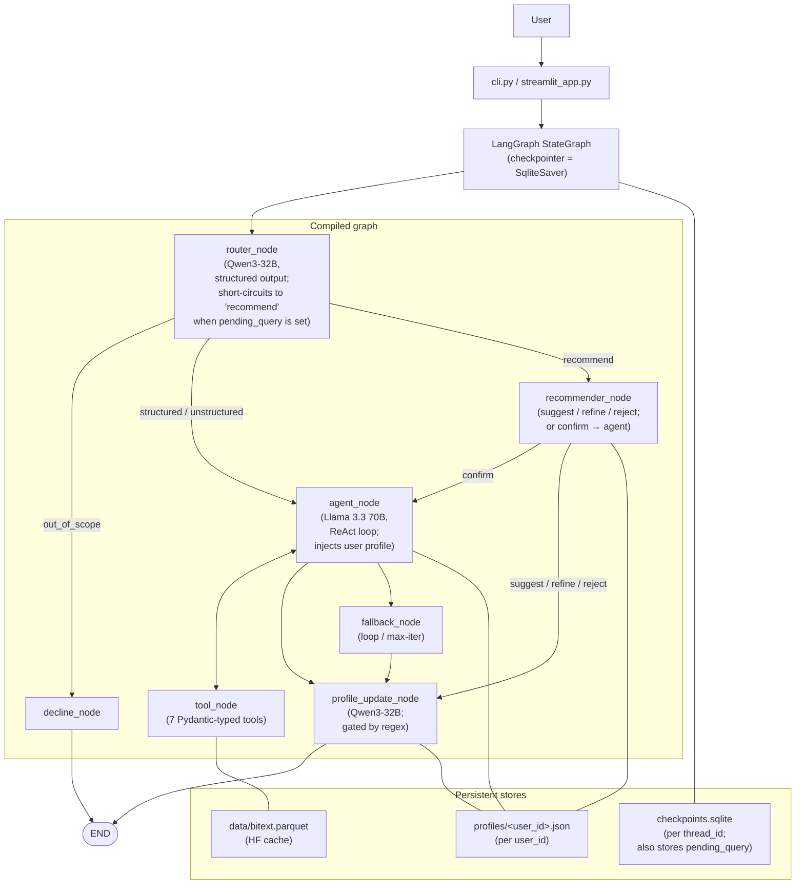

# Customer Service Data Analyst Agent

<p align="center">
  
</p>

A LangGraph ReAct agent that answers user questions about the
[Bitext customer-support dataset](https://huggingface.co/datasets/bitext/Bitext-customer-support-llm-chatbot-training-dataset).
Tasks 1, 2, and 3 are complete; Bonus A (Streamlit UI) and Bonus B (Query
Recommender) are also included.



---

## Quick start (5 minutes)

```bash
# 0. Get the code (skip if you already have the project directory)
git clone https://github.com/Nesher123/customer-service-agent.git
cd customer-service-agent
# — or unzip customer-service-agent.zip and cd into that folder

# 1. Install dependencies (Python 3.11+, uv)
uv sync --all-extras --all-groups

# 2. Configure the Nebius Token Factory key
cp .env.example .env
# edit .env, paste your key into NEBIUS_API_KEY

# 3. Run the CLI
uv run cs-agent --session demo --user ofir
```

The first run downloads the Bitext dataset from HuggingFace into
`data/bitext.parquet` (~5.7 MB, takes a few seconds). Subsequent runs are
instant — the parquet is reused.

---

## What works today

| Task | Status | Where |
|---|---|---|
| 1 — Initial agent (50 pts) | done | `src/cs_agent/`, `scripts/verify_task1.py` |
| 2a — Episodic memory (20 pts) | done | `src/cs_agent/memory/checkpoint.py`, `--session` flag, `scripts/verify_task2.py` |
| 2b — User profile (10 pts) | done | `src/cs_agent/memory/profile.py`, `profile_update_node`, `--user` flag |
| 3 — MCP server (20 pts) | done | `src/cs_agent/mcp_server/server.py`, `cs-agent-mcp` script, `scripts/verify_task3.py` |
| Bonus A — Streamlit UI (+10) | done | `src/cs_agent/ui/streamlit_app.py`, `cs-agent-ui` script, `scripts/verify_bonus_a.py` |
| Bonus B — Query recommender (+10) | done | `src/cs_agent/agent/recommender.py`, `state.pending_query`, `scripts/verify_bonus_b.py` |

---

## Running

### Interactive CLI

```bash
uv run cs-agent --session demo --user ofir          # full interactive REPL
uv run cs-agent --session demo --user ofir -v       # also show INFO logs
uv run cs-agent --help                              # all flags
```

`--session` is the LangGraph `thread_id` for the persistent
`SqliteSaver` checkpointer (Task 2a). The first run prints
`starting new session 'demo'`; subsequent runs against the same session
print `resumed session 'demo' (N prior turns)` and "show me 3 more"-style
follow-ups work across restarts.

`--user` is the per-user profile id (Task 2b). On any turn that contains
high-signal personal markers ("my name is …", "I prefer …", "remember
that …"), the agent updates `profiles/<user_id>.json` and uses that file
on every subsequent turn (any session) to personalise its responses.

The CLI prints every reasoning step in colour so the grader can see *how* the
agent arrived at its answer:

| Colour | Meaning |
|---|---|
| dim grey: `router → structured` | router decision |
| yellow: `→ tool_name(args)` | LLM emitted a tool call |
| green: `← tool_name → result` | tool returned an observation |
| green panel | agent's final natural-language answer |
| red panel | `decline_node` — out-of-scope |
| yellow panel | `fallback_node` — loop / max-iter short-circuit |
| cyan panel | `recommender_node` — query suggestion awaiting confirmation (Bonus B) |
| dim grey: `recommender → executing: …` | recommender dispatched the confirmed query to the agent |

Type `exit`, `quit`, or `:q` (or Ctrl-C / Ctrl-D) to leave.

### Streamlit chat UI (Bonus A)

```bash
uv run cs-agent-ui                                       # shortcut
# or
uv run streamlit run src/cs_agent/ui/streamlit_app.py    # explicit
```

Streamlit opens a local browser tab (default `http://localhost:8501`). The
layout is:

- **Main area:** standard chat — your messages and the agent's responses as
  bubbles. Every assistant turn carries a collapsed **`reasoning`** expander
  showing the router decision, tool calls, and tool results (so the grader
  sees *how* the answer was reached, mirroring the CLI's rich trace). Final
  out-of-scope declines render as a yellow warning; loop / max-iter
  fallbacks render as a blue info box; normal answers render as plain
  markdown.
- **Sidebar:** `session id` (LangGraph `thread_id`, default `default`) and
  `user id` (Task 2b profile key, default `anon`) text inputs plus a
  **Switch / reload session** button. The banner below the inputs reports
  whether the current session is new or resumed (`resumed session 'demo'
  (3 prior turns)`) and is computed straight from
  `graph.get_state(...).values["messages"]`.

The UI reuses the same compiled graph and `SqliteSaver` checkpointer as
the CLI (`@st.cache_resource` keeps them alive across Streamlit's reruns),
so a conversation started in the CLI resumes in the browser and vice
versa. Switching session ids in the sidebar reloads that thread's
persisted history into the chat view; reasoning rows for resumed turns
show tool calls + results only (router decisions are not retained in the
checkpoint).

### Programmatic verifiers

```bash
uv run python scripts/verify_task1.py    # 10 single-turn cases (Task 1)
uv run python scripts/verify_task2.py    # 2 multi-turn cases (Task 2): episodic
                                         # follow-up + cross-session profile recall
uv run python scripts/verify_task3.py    # 5 in-memory MCP tool round-trips (Task 3)
uv run python scripts/verify_bonus_a.py  # 4 Streamlit-UI plumbing cases (Bonus A)
uv run python scripts/verify_bonus_b.py  # 7 recommender cases (Bonus B)
```

`verify_task1.py` runs the 8 example queries from the assignment plus
2 extra cases (greeting, compound) and ends with
`Result: 10/10 passed, 0 failed`.

`verify_task2.py` runs both Task-2 acceptance scenarios end-to-end against
a tmp-dir checkpoint + profile (so it never pollutes your real working
state) and ends with `Result: 2/2 passed, 0 failed`.

`verify_task3.py` attaches a `fastmcp.Client` to the in-process MCP
server and exercises five tools end-to-end (no port, no Nebius key
needed) — ends with `Result: 5/5 passed, 0 failed` in well under a
second.

`verify_bonus_a.py` smoke-tests the Streamlit UI plumbing without
spinning up a browser: import safety of `cs_agent.ui.*`, chunk →
reasoning-step translation across all six node shapes, persisted-history
replay, plus one optional end-to-end turn through a tmp `SqliteSaver`
when `NEBIUS_API_KEY` is set. Ends with `Result: 4/4 passed, 0 failed`
(or 3 of 4 if the live-turn case is skipped without a key).

`verify_bonus_b.py` exercises the Query Recommender: the router's
short-circuit on `pending_query`, the suggest / confirm / refine / reject
branches of `recommender_node` with mocked LLMs, and one optional
end-to-end suggest→confirm flow against a tmp `SqliteSaver` (gated on
`NEBIUS_API_KEY`). Ends with `Result: 7/7 passed, 0 failed` (or 6 of 7
when live-flow is skipped).

### Test suite

```bash
uv run python -m pytest -m "not integration"   # 85 fast unit tests, ~3s
uv run python -m pytest -m integration         # 35 live tests, ~100s (Nebius for some;
                                               #   Task 3 MCP integration runs offline)
uv run python -m pytest                        # all 120 tests
```

---

## Walkthrough examples

Hands-on flows a grader can run to exercise every Task 1 + Task 2
behaviour. Run from the project root.

### Reset state (optional, for a clean demo)

```bash
rm -f checkpoints.sqlite checkpoints.sqlite-journal
rm -rf profiles/
```

### Flow 1 — Episodic memory across a process restart (Task 2a)

```bash
uv run cs-agent --session demo --user grader
```

Banner reads `starting new session 'demo'`. At the prompt:

```
you> Show me 3 examples of REFUND
you> exit
```

Now relaunch the same session:

```bash
uv run cs-agent --session demo --user grader
```

Banner now reads `resumed session 'demo' (1 prior turns)`. Type:

```
you> Show me 3 more
```

The agent treats this as a real follow-up — no clarification asked, fresh
examples returned. Conversation history survived the restart.

```bash
sqlite3 checkpoints.sqlite "SELECT thread_id, COUNT(*) FROM checkpoints GROUP BY thread_id;"
```

### Flow 2 — Profile, introduce + same-session recall (Task 2b)

```bash
uv run cs-agent --session intro --user ofir
```

```
you> Hi, my name is Ofir and I work as a data engineer
you> I prefer concise answers
you> What do you remember about me?
you> exit
```

Watch the trace: turns 1 and 2 trip the regex gate → the `profile` node
calls the LLM and writes JSON. Turn 3 the agent answers from the injected
profile block in its system prompt — **no tool calls**.

```bash
cat profiles/ofir.json
```

### Flow 3 — Cross-session profile recall

Same `--user ofir`, **different** `--session`:

```bash
uv run cs-agent --session work --user ofir
```

Banner: `starting new session 'work'` (fresh thread, no prior history).

```
you> What do you remember about me?
```

The agent answers with your name even though *this* session has zero prior
turns — profiles are keyed by user, not session.

### Flow 4 — Profile gate doesn't fire on dataset Q&A (cost guarantee)

```bash
uv run cs-agent --session qa --user fresh -v
```

```
you> How many refund requests did we get?
```

The agent loop runs but **no profile-update LLM call follows**. Confirm:

```bash
ls profiles/fresh.json   # No such file or directory
```

The cheap regex gate short-circuits — dataset Q&A turns pay zero extra
LLM cost.

### Flow 5 — Session isolation

```bash
uv run cs-agent --session alpha --user grader
# ask one question, then exit
uv run cs-agent --session beta --user grader
# Banner: 'starting new session beta' (NOT 'resumed'). Histories are independent.
```

### Flow 6 — Out-of-scope still gracefully declines

```bash
uv run cs-agent --session demo --user grader
```

```
you> Who won the 2024 Champions League?
you> What's the best CRM software?
```

Both land in the red `out-of-scope decline` panel, and bypass the profile
node entirely (an off-topic decline carries no user-relevant info).

### Flow 7 — Query Recommender (Bonus B)

The recommender suggests a concrete next query and only runs it after you
confirm. The full suggest → refine → confirm cycle mirrors the example in
the assignment brief.

```bash
uv run cs-agent --session recs --user ofir
```

```
you> Show me 3 examples from REFUND
you> What should I query next?
```

The cyan **recommender (awaiting confirmation)** panel appears with
something like:

> Based on your interest in refund data, you might want to: "What is the
> distribution of intents in the REFUND category?". Want me to run it,
> refine it, or pick something else?

Refine it:

```
you> I'd rather see examples
```

A new cyan panel proposes `"Show me 5 examples from the REFUND
category."`. Confirm:

```
you> Yes, do it
```

The CLI prints a `recommender → executing: …` dispatch line and the agent
loop runs the tools and renders the final green answer panel. Internally:

- `pending_query` is stored on the LangGraph checkpoint per `thread_id`,
  so quitting the REPL mid-suggestion and relaunching keeps the suggestion
  alive — you can confirm it the next day.
- The router short-circuits to `recommend` whenever `pending_query` is
  set, so a one-word "yes" / "no" reply is interpreted as confirm /
  reject rather than re-classified as a structured query.
- The historical "yes" stays in the message log; the recommender then
  appends the resolved query as a synthetic `HumanMessage` so the agent
  has clear instructions to execute.

You can also drop the suggestion entirely:

```
you> no, cancel
```

→ cyan **recommender (suggestion dropped)** panel; the next turn routes
normally through the router again.

### Flow 8 — Programmatic verifiers (one-shot, no REPL)

```bash
uv run python scripts/verify_task1.py    # 10 single-turn cases  (Task 1)
uv run python scripts/verify_task2.py    # 2 multi-turn cases    (Task 2, tmp dirs)
uv run python scripts/verify_bonus_b.py  # 7 recommender cases   (Bonus B)
```

All exit `0` on success and print a per-case PASS/FAIL table.

### Flow 9 — Targeted pytest runs

```bash
# Single test by name
uv run python -m pytest tests/test_profile_integration.py::test_profile_recall_across_sessions -v

# Just one test file
uv run python -m pytest tests/test_episodic_integration.py -v

# Verbose mode for the CLI surfaces router fallback / loop / profile-update INFO logs
uv run cs-agent --session demo --user ofir -v
```

### Inspection cheat-sheet

```bash
sqlite3 checkpoints.sqlite ".tables"
sqlite3 checkpoints.sqlite "SELECT DISTINCT thread_id FROM checkpoints;"
ls profiles/
python -m json.tool profiles/ofir.json
```

---

## MCP server (Task 3)

Six of the seven Bitext data tools are exposed as a [FastMCP](https://gofastmcp.com/)
server over the streamable-HTTP transport. The wrappers in
`src/cs_agent/mcp_server/server.py` are intentionally thin — each one
delegates straight to `cs_agent.tools.registry.TOOLS_BY_NAME[<name>].invoke(...)`,
so the LangGraph agent and the MCP server share one implementation.
`summarize` is intentionally absent because it requires a Nebius API key
to run, and we don't want to couple MCP clients to that.

Tools exposed: `list_categories`, `list_intents`, `get_distribution`,
`count_rows`, `get_examples`, `search_by_keyword`.

### Run the server

```bash
uv run cs-agent-mcp                              # 127.0.0.1:8765/mcp
uv run cs-agent-mcp --port 9000                  # custom port
uv run cs-agent-mcp --host 0.0.0.0 --port 9000   # bind all interfaces
```

The server prints a FastMCP banner and a uvicorn URL; Ctrl-C to stop.

### Connect from Python

```python
import asyncio
from fastmcp import Client

async def main():
    async with Client("http://127.0.0.1:8765/mcp") as client:
        tools = await client.list_tools()
        print(f"{len(tools)} tools:", [t.name for t in tools])

        cats = (await client.call_tool("list_categories", {})).data
        n_refunds = (await client.call_tool(
            "count_rows", {"category": "REFUND"}
        )).data
        print(f"{len(cats)} categories; {n_refunds} REFUND rows")

asyncio.run(main())
```

Expected output:

```
6 tools: ['list_categories', 'list_intents', 'get_distribution',
          'count_rows', 'get_examples', 'search_by_keyword']
11 categories; 2992 REFUND rows
```

### Connect from Cursor / Claude Desktop

Add to the client's MCP configuration:

```json
{
  "cs-agent-tools": {
    "url": "http://127.0.0.1:8765/mcp",
    "transport": "http"
  }
}
```

The server is local-only by default (no auth); change `--host` and add
auth (FastMCP supports several backends) if you need remote access.

---

## Architecture overview

Three guiding principles shape the design:

1. **One source of truth for tools.** The CLI agent, the MCP server, and
   the Streamlit UI all import the same `@tool`-decorated Python
   functions from `cs_agent.tools.registry`. MCP is just another transport;
   it is never a re-implementation.
2. **Two LLMs by role.** A small classifier (Qwen3-32B) handles routing,
   freeing the larger generator (Llama 3.3 70B) for reasoning + summarization.
   See [Models](#models).
3. **Three failure modes, each handled separately.**

   | Situation | Caught at | Response |
   |---|---|---|
   | Off-topic question ("Who won the UCL?") | `router_node` → `decline_node` | Polite decline + suggestion of in-scope queries |
   | On-topic but no tool fits ("Average instruction length?") | Agent system prompt's scoped-fallback rule | Honest "I can't do X, but I can do Y" |
   | Agent stuck or out of budget | `should_continue` + `fallback_node` | Surfaces the most recent tool result, or a max-iter message |

### Graph topology

The compiled graph in `src/cs_agent/agent/graph.py`:

```text
START
  |
  v
router  --[out_of_scope]--> decline -----------------> END
  |
  v
agent  <-----------------+
  |                       |
  +--[tool_calls?]--> tools
  |
  +--[done]----------> profile --> END
  |
  +--[loop / max-iter]--> fallback --> profile --> END
```

`profile` is a no-op for ~all dataset turns (cheap regex gate); it only
invokes the LLM and writes to disk when the latest user message contains
high-signal personal markers. Out-of-scope declines bypass `profile`.

### State

`src/cs_agent/agent/state.py` keeps the state minimal:

```python
class GraphState(TypedDict, total=False):
    messages: Annotated[list[BaseMessage], add_messages]
    route: Literal["structured", "unstructured", "out_of_scope"] | None
    iterations: int                # reset per turn; budget for the ReAct loop
    user_id: str                   # used by Task 2b to key the JSON profile
    pending_query: str | None      # reserved for Bonus B (recommender)
```

The CLI passes only the *new* `HumanMessage` per turn, plus an explicit
`iterations: 0, route: None` reset; the `add_messages` reducer + the
`SqliteSaver` checkpointer own the running history.

### Persistence

| What | Where | Lifetime | Format |
|---|---|---|---|
| Conversation history | `checkpoints.sqlite` | per `--session` (thread) | LangGraph `SqliteSaver` |
| User facts | `profiles/<user_id>.json` | per `--user` | Plain JSON, `UserProfile` Pydantic schema |

The profile is intentionally NOT in `GraphState` — it's per-user (one user
can have many sessions), so it's loaded lazily from disk on every turn.
This also lets a grader `cat profiles/ofir.json` to inspect the agent's
memory directly.

---

## Models

Both default models can be overridden via env vars (`CS_AGENT_ROUTER_MODEL`,
`CS_AGENT_AGENT_MODEL`, `CS_AGENT_NEBIUS_BASE_URL`).

### Router — `Qwen/Qwen3-32B`

A mid-size LLM with strong support for `with_structured_output(...)`. The
router's job is a 3-class classification (`structured` / `unstructured` /
`out_of_scope`) plus a one-sentence rationale, returned as a typed
`RouterDecision` Pydantic. Latency observed: 0.5–4 s per call. We tried Gemma 3
27B first but it was unstable on the Nebius Token Factory endpoint during
development; Qwen3-32B has been reliable throughout.

### Agent — `meta-llama/Llama-3.3-70B-Instruct`

Used for the ReAct loop (tool selection + final answer synthesis) and inside
the `summarize` tool for unstructured queries. Strong at tool-calling,
multilingual, and produces high-quality summaries.

### Why a split-model setup?

- **Cost:** routing is high-frequency; 32B is much cheaper than 70B.
- **Latency:** sub-second router for snappier UX.
- **Specialization:** structured output works well at small sizes; reasoning +
  summarization benefit from larger context understanding.

### Resilience

If the primary router model fails (timeout, 404, schema violation),
`agent/router.py:classify` transparently retries with the agent model. If both
fail, the route defaults to `structured` (not `out_of_scope`) so legitimate
questions still reach the agent loop during transient outages. Unit-tested in
`tests/test_router.py`.

---

## Tools reference

All seven tools live under `src/cs_agent/tools/`. Every tool has a Pydantic
input schema (`tools/schemas.py`), a clear docstring (visible to the LLM), and
returns small JSON-serialisable values. The schemas inherit from a tiny
`LLMToolBase` whose `model_validator` cleans common LLM artefacts — string
`"null"` / `"None"` / `""` for optional fields, and JSON-encoded list literals
for `columns` — so we never waste a ReAct iteration on schema-rejection retries.

| Tool | Purpose | Typical args |
|---|---|---|
| `list_categories` | All distinct high-level categories | — |
| `list_intents` | All intents, optionally scoped by category | `category="REFUND"` |
| `get_distribution` | Row counts grouped by category or intent | `group_by="intent", scope_category="ACCOUNT"` |
| `count_rows` | Count rows matching optional filters | `category, intent, keyword` |
| `get_examples` | Sample example rows | `category, intent, keyword, n, columns` |
| `search_by_keyword` | Substring search over user `instruction` text | `keyword="money back", n=10` |
| `summarize` | LLM-backed summary of a slice of rows | `category, intent, role, sample_size` |

`summarize` is the only LLM-backed tool — it samples up to `sample_size` rows
matching the filters and asks Llama to produce a 4–7 bullet summary.

---

## Project layout

```
assignment/
├── README.md
├── pyproject.toml                   # uv-managed; deps + ruff/pytest config
├── .env.example                     # NEBIUS_API_KEY placeholder + overrides
├── .gitignore                       # data/, checkpoints.sqlite, profiles/, .venv
├── src/cs_agent/
│   ├── __init__.py
│   ├── config.py                    # paths, model ids, MAX_ITERATIONS
│   ├── llm.py                       # cached Nebius LLM factories (router + agent)
│   ├── cli.py                       # rich-formatted REPL (Task 1)
│   ├── data/
│   │   └── loader.py                # HF -> parquet cache + dataset_summary
│   ├── tools/
│   │   ├── schemas.py               # Pydantic input schemas + LLMToolBase
│   │   ├── catalog.py               # list_categories, list_intents, get_distribution
│   │   ├── filter.py                # count_rows, get_examples, search_by_keyword
│   │   ├── summarize.py             # LLM-backed summarize
│   │   └── registry.py              # DATA_TOOLS export
│   ├── agent/
│   │   ├── state.py                 # GraphState
│   │   ├── prompts.py               # ROUTER_SYSTEM, AGENT_SYSTEM_TEMPLATE, ROUTE_HINTS
│   │   ├── router.py                # RouterDecision + classify + router_node
│   │   ├── nodes.py                 # agent_node, decline_node, fallback_node, profile_update_node
│   │   └── graph.py                 # build_graph()
│   ├── memory/
│   │   ├── checkpoint.py            # Task 2a: SqliteSaver factory
│   │   └── profile.py               # Task 2b: UserProfile + load/save + gate
│   ├── mcp_server/
│   │   └── server.py                # Task 3: FastMCP streamable-HTTP server
│   └── ui/
│       ├── rendering.py             # Bonus A: pure chunk/message -> turn helpers
│       └── streamlit_app.py         # Bonus A: Streamlit chat UI
├── scripts/
│   ├── verify_task1.py              # 10-case end-to-end verifier (Task 1)
│   ├── verify_task2.py              # 2-case multi-turn verifier (Task 2)
│   ├── verify_task3.py              # 5-case in-memory MCP round-trip (Task 3)
│   └── verify_bonus_a.py            # 4-case Streamlit UI plumbing (Bonus A)
├── tests/
│   ├── test_tools.py                # unit (fixture DataFrame), 26 tests
│   ├── test_tools_integration.py    # 13 live-DataFrame tests, marked 'integration'
│   ├── test_router.py               # 13 unit tests with mocked LLMs
│   ├── test_agent_integration.py    # 10 parametrized live tests, marked 'integration'
│   ├── test_checkpoint.py           # 6 unit tests for the saver factory (Task 2a)
│   ├── test_episodic_integration.py # 3 live tests for cross-restart memory (Task 2a)
│   ├── test_profile.py              # 32 unit tests for profile gate/schema/IO/node (Task 2b)
│   ├── test_profile_integration.py  # 3 live tests for cross-session recall (Task 2b)
│   ├── test_mcp_server.py           # 8 unit tests for MCP tool registration (Task 3)
│   └── test_mcp_integration.py      # 6 in-memory MCP Client round-trips (Task 3)
├── checkpoints.sqlite               # gitignored (created on first CLI run)
├── profiles/                        # gitignored (created on first personal-info turn)
├── data/                            # gitignored
└── .fon/check/config.yaml           # documents fon-check exceptions
```

---

## Known limitations

These are documented Llama 3.3 70B quirks observed during Task 1 development.
None of them block any of the 8 brief queries from the assignment, but they're
worth knowing.

1. **Loop short-circuit on simple queries.** Llama occasionally re-invokes a
   tool with identical args after receiving the result (a "verification" tic).
   `should_continue` detects identical signatures and routes to `fallback_node`,
   which surfaces the most recent tool result as the answer. The user sees a
   correct answer prefixed with *"Based on the &lt;tool&gt; tool result:"*.
2. **Compound questions get textualised.** When a single message asks two
   things at once ("How many refund requests AND summarize complaints"),
   Llama sometimes describes the tool calls as JSON in plain text instead of
   emitting them via the function-calling protocol. Workaround: split into two
   turns. The verifier's `compound` case asserts routing only and notes this.
3. **The HF dataset card is out of date.** As of writing, the live data has
   11 categories — `[ACCOUNT, CANCEL, CONTACT, DELIVERY, FEEDBACK, INVOICE,
   ORDER, PAYMENT, REFUND, SHIPPING, SUBSCRIPTION]` — and `REFUND` includes the
   `get_refund` intent (which the README omits). Tools never hardcode
   categories or intents; everything is read from `dataset_summary()`.

---

## Submission

- **Solo submission:** Ofir Nesher.
- **Repo / zip name:** `customer-service-agent`.
- The grader can either clone the repo or unzip the archive and follow
  [Quick start](#quick-start-5-minutes).
- A `data/` directory containing the parquet cache will be created on first
  run (gitignored / not in zip).
- A Nebius Token Factory API key is required (`.env`).
